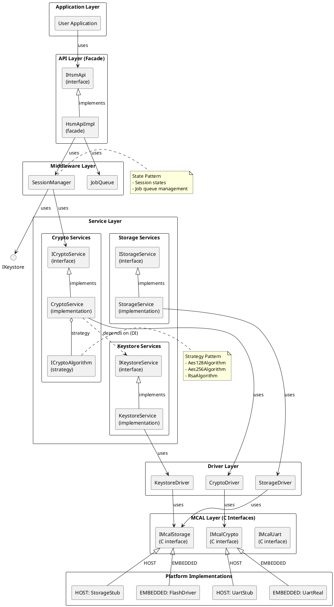
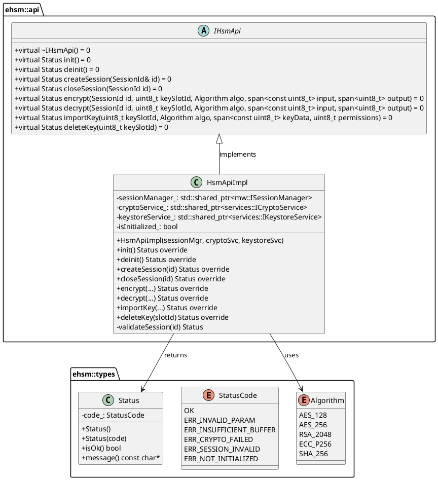
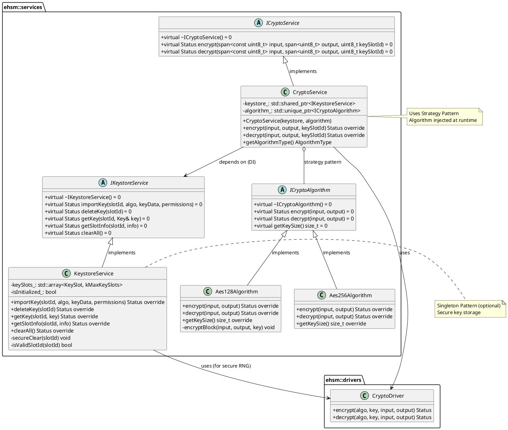
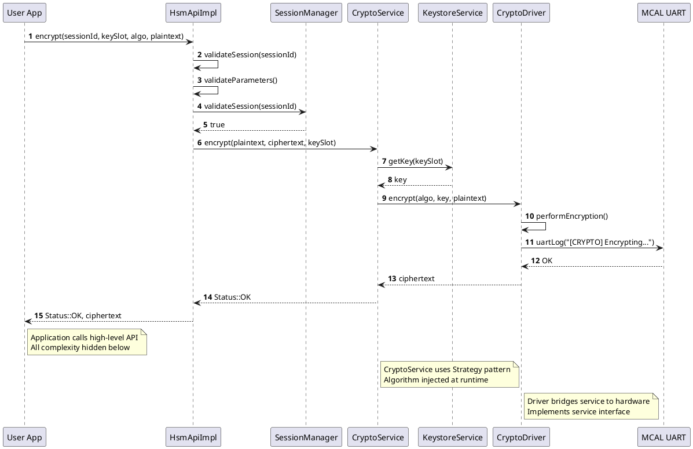
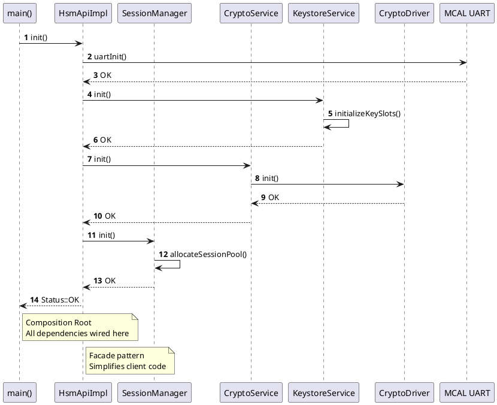
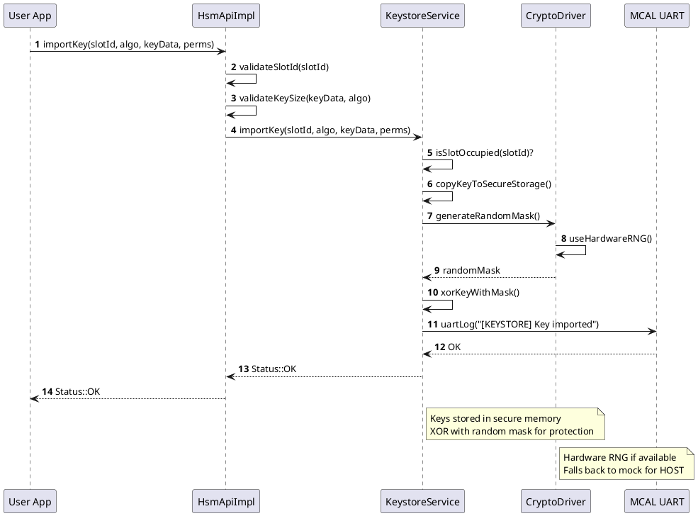
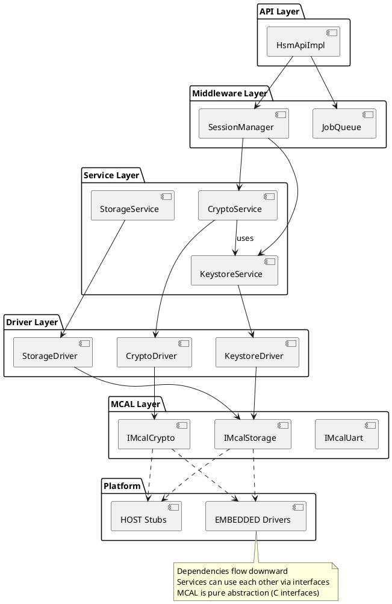
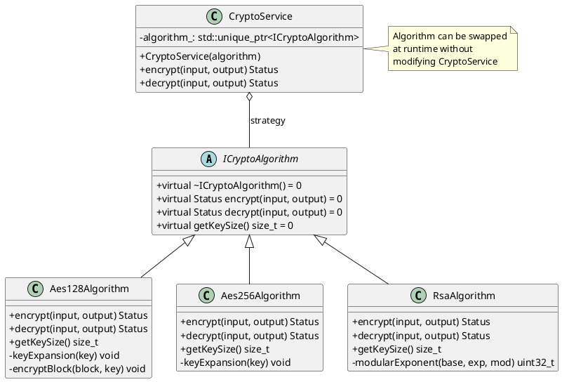
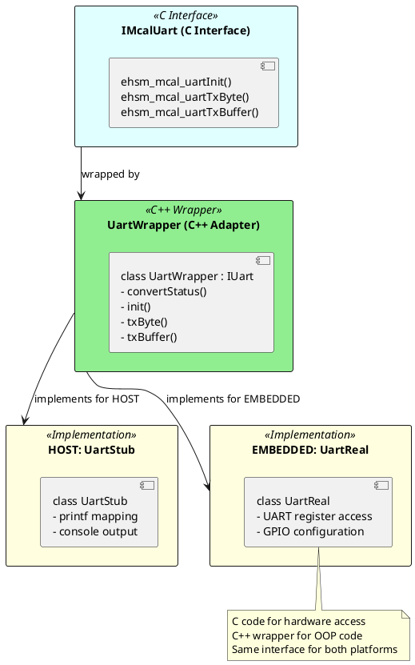

# Embedded HSM Firmware - Architecture Design

**Document ID:** `HSM-ARCH-001`
**Version:** 1.0.0
**Last Updated:** 2026-03-12
**Applicable To:** Embedded HSM Firmware C++ Implementation
**Owner:** Embedded Engineering Team

---

## Table of Contents

1. [Architecture Overview](#1-architecture-overview)
2. [Layer Architecture](#2-layer-architecture)
3. [Component Diagram](#3-component-diagram)
4. [Class Diagrams](#4-class-diagrams)
5. [Sequence Diagrams](#5-sequence-diagrams)
6. [Dependency Graph](#6-dependency-graph)
7. [Design Patterns](#7-design-patterns)
8. [MCAL Abstraction](#8-mcal-abstraction)
9. [Extension Points](#9-extension-points)

---

## 1. Architecture Overview

### 1.1 Design Goals

| Goal | Description |
|------|-------------|
| **Portability** | Any MCU can be supported by implementing MCAL interfaces |
| **Testability** | All layers can be tested in isolation with mocks |
| **Maintainability** | Clear separation of concerns, SOLID principles |
| **Security** | Key material never exposed, secure erasure |
| **Performance** | Zero-copy where possible, deterministic execution |

### 1.2 Architectural Principles

```
┌─────────────────────────────────────────────────────────────┐
│  PRINCIPLES:                                                │
│  1. Dependency Inversion: High-level doesn't depend on      │
│     low-level. Both depend on abstractions.                 │
│  2. Interface Segregation: Many specific interfaces > one   │
│     general interface.                                      │
│  3. Single Responsibility: Each class has one reason to     │
│     change.                                                 │
│  4. Open/Closed: Open for extension, closed for            │
│     modification.                                           │
│  5. Liskov Substitution: Derived classes must be            │
│     substitutable for base classes.                         │
└─────────────────────────────────────────────────────────────┘
```

---

## 2. Layer Architecture

### 2.1 Layer Breakdown

```
┌─────────────────────────────────────────────────────────────┐
│  Layer 1: API Layer (Facade)                                │
│  ─────────────────────────────────────────────────────────  │
│  Purpose: Simple, unified interface for application code    │
│  Components: IHsmApi, HsmApiImpl                            │
│  Dependencies: Middleware layer interfaces                  │
├─────────────────────────────────────────────────────────────┤
│  Layer 2: Middleware Layer (Router)                         │
│  ─────────────────────────────────────────────────────────  │
│  Purpose: Session management, job queuing, routing          │
│  Components: SessionManager, JobQueue                       │
│  Dependencies: Service layer interfaces                     │
├─────────────────────────────────────────────────────────────┤
│  Layer 3: Service Layer (Business Logic)                    │
│  ─────────────────────────────────────────────────────────  │
│  Purpose: Core business logic, crypto operations            │
│  Components: CryptoService, KeystoreService, StorageService │
│  Dependencies: Service interfaces (can use each other)      │
├─────────────────────────────────────────────────────────────┤
│  Layer 4: Driver Layer (Hardware Bridge)                    │
│  ─────────────────────────────────────────────────────────  │
│  Purpose: Bridge between services and hardware              │
│  Components: CryptoDriver, KeystoreDriver, StorageDriver    │
│  Dependencies: MCAL interfaces                              │
├─────────────────────────────────────────────────────────────┤
│  Layer 5: MCAL Layer (Hardware Abstraction)                 │
│  ─────────────────────────────────────────────────────────  │
│  Purpose: Hardware-specific code (C language)               │
│  Components: IMcalUart, IMcalStorage, IMcalCrypto           │
│  Dependencies: None (hardware registers)                    │
└─────────────────────────────────────────────────────────────┘
```

---

## 3. Component Diagram



---

## 4. Class Diagrams

### 4.1 API Layer Class Diagram



### 4.2 Service Layer Class Diagram



### 4.3 MCAL Layer Class Diagram

```plantuml
@startuml Class Diagram - MCAL Layer
skinparam classAttributeIconSize 0

package "ehsm::mcal (C Interfaces)" {
  artifact "imcal_uart.h" {
    [ehsm_status_t ehsm_mcal_uartInit(void)]
    [ehsm_status_t ehsm_mcal_uartTxByte(uint8_t data)]
    [ehsm_status_t ehsm_mcal_uartTxBuffer(const uint8_t*, size_t)]
  }
  
  artifact "imcal_storage.h" {
    [ehsm_status_t ehsm_mcal_storageInit(void)]
    [ehsm_status_t ehsm_mcal_storageRead(addr, data, len)]
    [ehsm_status_t ehsm_mcal_storageWrite(addr, data, len)]
    [ehsm_status_t ehsm_mcal_storageEraseSector(addr)]
  }
}

package "ehsm::mcal::cpp (C++ Wrappers)" {
  abstract class "IUart" {
    +virtual ~IUart() = 0
    +virtual Status init() = 0
    +virtual Status txByte(data) = 0
    +virtual Status txBuffer(span) = 0
  }
  
  abstract class "IStorage" {
    +virtual ~IStorage() = 0
    +virtual Status init() = 0
    +virtual Status read(addr, data, len) = 0
    +virtual Status write(addr, data, len) = 0
    +virtual Status eraseSector(addr) = 0
  }
}

package "HOST Implementations" {
  class "UartStub" {
    -isInitialized_: bool
    +init() Status override
    +txByte(data) Status override
    +txBuffer(data) Status override
    -logToConsole(data) void
  }
  
  class "StorageStub" {
    -buffer_: std::array<uint8_t, Capacity>
    +init() Status override
    +read(addr, data, len) Status override
    +write(addr, data, len) Status override
    +eraseSector(addr) Status override
  }
}

package "EMBEDDED Implementations" {
  class "UartReal" {
    -uartInstance_: UART_TypeDef*
    -isInitialized_: bool
    +init() Status override
    +txByte(data) Status override
    +txBuffer(data) Status override
    -waitUntilTxEmpty() void
  }
  
  class "FlashDriver" {
    -flashConfig_: FLASH_Config_TypeDef
    +init() Status override
    +read(addr, data, len) Status override
    +write(addr, data, len) Status override
    +eraseSector(addr) Status override
    -waitForOperation() void
  }
}

IUart <|-- UartStub : HOST implements
IUart <|-- UartReal : EMBEDDED implements
IStorage <|-- StorageStub : HOST implements
IStorage <|-- FlashDriver : EMBEDDED implements

note bottom of "imcal_uart.h"
  Pure C interface
  Compiled as C code
  extern "C" linkage
end note

note bottom of UartStub
  Maps UART to printf
  For GDB debugging
end note

note bottom of UartReal
  Direct register access
  MCU-specific (STM32, NXP, etc.)
end note

@enduml
```

---

## 5. Sequence Diagrams

### 5.1 Encryption Flow Sequence



### 5.2 Initialization Sequence



### 5.3 Key Import Sequence



---

## 6. Dependency Graph



---

## 7. Design Patterns

### 7.1 Pattern Summary

| Pattern | Location | Purpose |
|---------|----------|---------|
| **Facade** | API Layer | Simplify client interface |
| **Strategy** | Crypto Service | Algorithm selection |
| **Factory** | Algorithm creation | Object creation |
| **Dependency Injection** | All layers | Decouple dependencies |
| **Singleton** | Keystore Service | Controlled global access |
| **Observer** | Event system | Async notifications |
| **State** | Session Manager | Session state machine |
| **Adapter** | MCAL wrappers | C to C++ interface |

### 7.2 Strategy Pattern Detail



### 7.3 Dependency Injection Detail

```plantuml
@startuml Dependency Injection
skinparam classAttributeIconSize 0

package "Interfaces" {
  abstract class "ICryptoService" {
    +encrypt(...) = 0
    +decrypt(...) = 0
  }
  
  abstract class "IKeystoreService" {
    +getKey(...) = 0
    +importKey(...) = 0
  }
}

package "Implementations" {
  class "CryptoService" {
    -keystore_: std::shared_ptr<IKeystoreService>
    -algorithm_: std::unique_ptr<ICryptoAlgorithm>
    +CryptoService(keystore, algorithm)
  }
  
  class "KeystoreService" {
    +getKey(...) override
    +importKey(...) override
  }
}

package "Composition Root" {
  class "main()" {
    +main() int
  }
}

ICryptoService <|-- CryptoService
IKeystoreService <|-- KeystoreService

main() --> KeystoreService : creates
main() --> CryptoService : creates with DI
CryptoService --> IKeystoreService : injected

note right of main()
  Composition Root
  All dependencies wired here
  Services never create dependencies
end note

note left of CryptoService
  Constructor Injection
  Dependencies passed in
  Not created internally
end note

@enduml
```

---

## 8. MCAL Abstraction

### 8.1 MCAL Interface Design

```cpp
// C Interface (imcal_uart.h)
#pragma once

#ifdef __cplusplus
extern "C" {
#endif

typedef enum {
    EHSM_STATUS_OK = 0,
    EHSM_STATUS_ERR_INVALID_PARAM = -1
} ehsm_status_t;

ehsm_status_t ehsm_mcal_uartInit(void);
ehsm_status_t ehsm_mcal_uartTxByte(uint8_t data);
ehsm_status_t ehsm_mcal_uartTxBuffer(const uint8_t* data, size_t length);

#ifdef __cplusplus
}
#endif
```

### 8.2 C++ Wrapper

```cpp
// C++ Wrapper (uart_wrapper.hpp)
#pragma once

#include "imcal_uart.h"
#include "iuart.hpp"

namespace ehsm::mcal {

class UartWrapper : public IUart {
public:
    Status init() override {
        return convertStatus(ehsm_mcal_uartInit());
    }
    
    Status txByte(uint8_t data) override {
        return convertStatus(ehsm_mcal_uartTxByte(data));
    }
    
    Status txBuffer(std::span<const uint8_t> data) override {
        return convertStatus(
            ehsm_mcal_uartTxBuffer(data.data(), data.size())
        );
    }

private:
    static Status convertStatus(ehsm_status_t cStatus) {
        // Convert C status to C++ Status
    }
};

} // namespace ehsm::mcal
```

### 8.3 Platform Abstraction



---

## 9. Extension Points

### 9.1 Adding New Algorithm

```
1. Create new class inheriting from ICryptoAlgorithm
2. Implement encrypt(), decrypt(), getKeySize()
3. Register with CryptoAlgorithmFactory
4. Inject into CryptoService via constructor

Example:
class ChaCha20Algorithm : public ICryptoAlgorithm {
    Status encrypt(...) override { /* ... */ }
    Status decrypt(...) override { /* ... */ }
    size_t getKeySize() const override { return 32; }
};
```

### 9.2 Adding New Storage Backend

```
1. Implement IStorage interface
2. Create driver that uses new storage
3. Wire in composition root

Example:
class EepromStorage : public IStorage {
    Status read(...) override { /* EEPROM read */ }
    Status write(...) override { /* EEPROM write */ }
    Status erase(...) override { /* EEPROM erase */ }
};
```

### 9.3 Adding New MCU Target

```
1. Create new MCAL implementation in src/mcal/
2. Implement C interfaces for UART, Storage, Crypto
3. Update CMakeLists.txt for new target
4. No changes to upper layers needed!

Example:
src/mcal/stm32f4/
├── mcal_uart.c
├── mcal_storage.c
└── mcal_crypto.c
```

---

## Appendix A: File Organization

```
embedded_hsm/
├── include/ehsm/              # Public headers
│   ├── api/
│   │   ├── ihsm_api.hpp
│   │   └── hsm_api.hpp
│   └── types/
│       ├── status.hpp
│       └── algorithm.hpp
│
├── src/
│   ├── api/
│   │   └── hsm_api_impl.cpp
│   ├── middleware/
│   │   └── session_manager.cpp
│   ├── services/
│   │   ├── crypto/
│   │   │   ├── crypto_service.cpp
│   │   │   └── algorithms/
│   │   │       ├── aes128_algorithm.cpp
│   │   │       └── aes256_algorithm.cpp
│   │   └── keystore/
│   │       └── keystore_service.cpp
│   ├── drivers/
│   │   └── crypto_driver.cpp
│   └── mcal/
│       ├── uart/
│       │   ├── mcal_uart_stub.c      # HOST
│       │   └── mcal_uart_real.c      # EMBEDDED
│       └── storage/
│           ├── mcal_storage_stub.c   # HOST
│           └── mcal_storage_flash.c  # EMBEDDED
│
└── tests/
    ├── test_crypto_service.cpp
    └── mocks/
        └── mock_keystore.hpp
```

---

**Document End**
